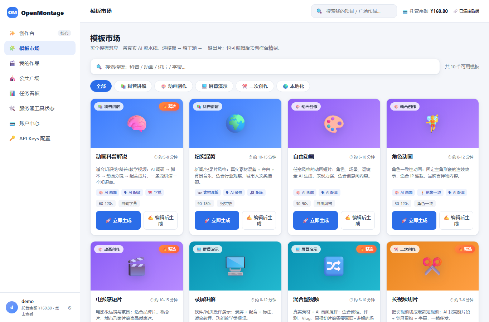

<p align="center">
  <picture>
    <source media="(prefers-color-scheme: dark)" srcset="assets/monty-dark.svg">
    
  </picture>
</p>

<p align="center"><sub><em>Monty the Clapper — OpenMontage 的官方吉祥物</em></sub></p>

<h1 align="center">OpenMontage Plus</h1>

<p align="center"><strong>开源的、代理化（agentic）视频制作系统 + 自带 Web 平台与真实成本计量</strong></p>

<p align="center">
  <a href="https://img.shields.io/github/license/sunqionggang/openMontagePlus"></a>
  <a href="https://img.shields.io/github/last-commit/sunqionggang/openMontagePlus"></a>
  <a href="https://img.shields.io/github/stars/sunqionggang/openMontagePlus"></a>
  <a href="https://img.shields.io/badge/Python-3.10%2B-3776AB?style=for-the-badge&logo=python&logoColor=white"></a>
  <a href="https://img.shields.io/badge/Node-18%2B-339933?style=for-the-badge&logo=node.js&logoColor=white"></a>
</p>

<p align="center">
  <a href="#快速开始-quick-start">快速开始</a> &nbsp;·&nbsp;
  <a href="#web-平台-om">Web 平台</a> &nbsp;·&nbsp;
  <a href="#流水线-pipelines">流水线</a> &nbsp;·&nbsp;
  <a href="#支持的提供商">提供商</a> &nbsp;·&nbsp;
  <a href="AGENT_GUIDE.md">智能体指南</a> &nbsp;·&nbsp;
  <a href="CONTRIBUTING.md">贡献</a>
</p>

---

将你的 AI 编程助手变成一个完整的视频制作工作室。用大白话描述需求，智能体自动完成研究、脚本、资产生成、剪辑与最终合成。

**本项目与上游的关系**：OpenMontage Plus 基于开源项目 [OpenMontage](https://github.com/calesthio/OpenMontage)（agentic 视频流水线引擎）构建，在保留其完整引擎能力的基础上，额外增加了一个 **Web 平台（`om/`）**：真实成本计量、托管代付模式、账户中心、作品广场、模板市场与服务器工具状态页。上游项目的官方演示视频可前往上游仓库观看。

---

## Web 平台（`om/`）

这是本 fork 的差异化能力——把"能跑通流水线"升级成"能给用户用的产品"。

🌐 **在线体验**：http://212.129.154.41:8000/prototype



*截图：模板市场——搜索、分类筛选、精选标记、一键生成/编辑后生成，所有卡片都对应真实 AI 视频流水线。*

| 模块 | 能力 | 状态 |
|------|------|------|
| **账户中心** | 注册 / 登录 / Token 鉴权（PBKDF2 加盐哈希）、余额、充值、成本账本 | ✅ 已上线验证 |
| **真实成本计量** | 按工具计价（图像 / TTS / 素材等），逐条记录 `hosted`（平台代付）与 `byok`（自带 Key）成本 | ✅ 已上线验证 |
| **托管模式** | 用户无 Key 时，平台用服务器内置 Key 跑任务并从其余额扣费；有 Key 的用户自付，不扣平台余额 | ✅ 已端到端实证 |
| **作品 / 公共广场** | 我的作品、公共广场列表，带真实封面图 | ✅ 已上线 |
| **模板市场** | 搜索、分类筛选、精选标记、一键生成 | ✅ 已上线 |
| **服务器工具状态** | 独立页面展示各生成工具 / Key 可用性 | ✅ 已上线 |

> **计量精度**：成本以 6 位小数记账，避免微额任务（如单段 TTS ≈ 8e-6 USD）被舍入归零。

### 启动 Web 平台

```bash
# 依赖
pip install -r requirements.txt
cd om && python -m pip install -r requirements.txt   # 如 om/ 有独立依赖
cd ..

# 配置（复制示例并填入你的 Key）
cp .env.example .env

# 启动服务（默认 http://localhost:8000）
python -m om.server
```

账户相关接口：`GET /api/me/account`、`POST /api/me/recharge`、`POST /api/jobs/submit`。

---

## 快速开始（Quick Start）

### 环境要求

- **Python 3.10+** — [python.org](https://www.python.org/downloads/)
- **FFmpeg** — `brew install ffmpeg` / `sudo apt install ffmpeg` / [ffmpeg.org](https://ffmpeg.org/download.html)
- **Node.js 18+** — [nodejs.org](https://nodejs.org/)
- **一个 AI 编程助手** — Claude Code、Cursor、Copilot、Windsurf、Codex

### 安装与运行

```bash
git clone https://github.com/sunqionggang/openMontagePlus.git
cd openMontagePlus
make setup
```

在 AI 编程助手中打开项目，然后告诉它你的需求：

```
"制作一个 60 秒的动画解说视频，讲解神经网络是如何学习的"
```

智能体会先用实时网络搜索研究主题，生成 AI 图像，撰写并配音脚本，自动寻找免版税背景音乐，烧录词级字幕，最后渲染成片。成片前系统会跑多点自检（ffprobe 校验、抽帧、音频电平分析、交付承诺验证、字幕检查）。每次供应商选择都会在 7 个维度上打分并记录可审计的决策日志，每个创意节点都需要你确认。

> **没有 `make`？** macOS/Linux：`python3 -m venv .venv && source .venv/bin/activate && python -m pip install -r requirements.txt && cd remotion-composer && npm install && cd .. && python -m pip install piper-tts && cp .env.example .env`
>
> Windows PowerShell：`py -3 -m venv .venv; .\.venv\Scripts\Activate.ps1; python -m pip install -r requirements.txt; cd remotion-composer; npm install; cd ..; python -m pip install piper-tts; Copy-Item .env.example .env`

### 添加 API Key（可选，Key 越多工具越多）

```bash
# .env — 每个 Key 都是可选的，填你有的即可

# 图像 + 视频网关：
FAL_KEY=your-key               # FLUX 图像 + Google Veo、Kling、MiniMax 视频
OPENAI_API_KEY=your-key        # OpenAI TTS、GPT Image 图像
GOOGLE_API_KEY=your-key       # Google Imagen 图像、Google TTS（700+ 声音）
PEXELS_API_KEY=your-key        # 免费库存视频与图像
PIXABAY_API_KEY=your-key       # 免费库存视频与图像
ELEVENLABS_API_KEY=your-key    # 顶级 TTS、AI 音乐、音效
# …更多见 .env.example
```

---

## 零 Key 也能出片

开箱即用的 `make setup` 已提供：

| 能力 | 免费工具 | 作用 |
|------|----------|------|
| **旁白** | Piper TTS | 免费离线文本转语音 |
| **开源素材** | Archive.org + NASA + Wikimedia Commons | 免费/开放档案影像 |
| **额外素材** | Pexels + Unsplash + Pixabay | 免费库存素材（开发者 Key 可免费申请） |
| **合成（React）** | Remotion | 基于 React 的程序化视频渲染 |
| **后期** | FFmpeg | 编码、字幕烧录、音频混音、调色 |
| **字幕** | 内置 | 自动生成带词级时间轴字幕 |

---

## 流水线（Pipelines）

每条流水线都是一条完整的制作工作流，从创意到成片。

| 流水线 | 产出 | 适用 |
|--------|------|------|
| **动画解说 Animated Explainer** | 含研究/旁白/视觉/音乐的 AI 解说 | 教育、教程、主题拆解 |
| **动画 Animation** | 动态图形、动态排版 | 社媒、产品演示 |
| **电影级 Cinematic** | 预告片、前导片 | 品牌片、宣传 |
| **片段工厂 Clip Factory** | 长素材批量切成短视频 | 内容二创 |
| **纪录片蒙太奇 Documentary Montage** | 从免费/开放档案剪辑真实动态影像 | 视频随笔、真实素材 |
| **混合 Hybrid** | 源素材 + AI 生成辅助视觉 | 用图形增强现有画面 |
| **本地化与配音 Localization & Dub** | 字幕、配音、翻译 | 多语言分发 |
| **播客重制 Podcast Repurpose** | 播客转视频 | 播客营销 |
| **屏幕演示 Screen Demo** | 软件录屏与演示 | 产品演示、文档 |
| **口播 Talking Head** | 真人出镜演讲视频 | 演示、vlog、访谈 |

每条流水线统一流程：`研究 → 提案 → 脚本 → 场景规划 → 资产生成 → 剪辑 → 合成`，每个阶段都有专门的导演技能（Markdown 指令文件）指导智能体执行。

---

## 支持的提供商

> 完整设置指南（定价与免费额度）：[`docs/PROVIDERS.md`](docs/PROVIDERS.md)

- **视频生成**：Kling、Runway Gen-4、Google Veo 3、MiniMax、HeyGen、WAN 2.1 / Hunyuan / CogVideo（本地 GPU）、Pexels / Pixabay / Wikimedia（素材库）
- **图像生成**：FLUX、Google Imagen、GPT Image、Recraft、Local Diffusion、ManimCE（数学动画）
- **文本转语音**：ElevenLabs、Google TTS（700+ 声音）、OpenAI TTS、Piper（本地免费）
- **音乐与音效**：Suno、ElevenLabs Music/SFX
- **后期与增强**：FFmpeg、视频拼接/裁剪、音频混音、Real-ESRGAN 放大、背景移除、人脸增强/修复、WhisperX 转写、场景检测、CLIP/BLIP-2 分析
- **合成引擎**：Remotion（React）、HyperFrames（HTML/CSS/GSAP）、FFmpeg

---

## 架构

```
OpenMontage/
├── om/                 # Web 平台（本 fork 新增）：server / db / jobs / meter / 账户与计量
├── tools/              # 100+ Python 工具（智能体的"手"）
├── pipeline_defs/      # YAML 流水线清单
├── skills/             # Markdown 技能文件（智能体的"知识"）
├── schemas/            # JSON Schema 契约校验
├── styles/             # 视觉风格剧本
├── remotion-composer/  # React/Remotion 视频合成引擎
├── lib/                # 核心基础设施（配置、检查点、流水线加载）
└── tests/              # 契约测试、QA 集成测试
```

OpenMontage 采用 **agent-first** 架构：没有代码编排器，你的 AI 编程助手本身就是编排器。所有创意决策、编排逻辑、审查标准都写在可读的指令文件（YAML 清单 + Markdown 技能）中，可检查、可定制。

---

## 生产治理与预算管控

- **质量关卡**：合成前验证（拦截"PPT 式"渲染）、渲染后自检（ffprobe + 抽帧 + 音频分析）、PPT 风险评分、源素材探测。
- **7 维评分选商**：任务契合(30%)、输出质量(20%)、控制(15%)、可靠性(15%)、成本(10%)、延迟(5%)、连续性(5%)，决策全程可审计。
- **预算管控**：执行前预估、调用前锁预算、事后结算；模式 `observe` / `warn` / `cap`；单动作超阈值暂停确认。

---

## 智能体兼容性

| 平台 | 配置文件 |
|------|----------|
| Claude Code | `CLAUDE.md` |
| Cursor | `CURSOR.md` + `.cursor/rules/` |
| GitHub Copilot | `COPILOT.md` + `.github/copilot-instructions.md` |
| Codex | `CODEX.md` |
| Windsurf | `.windsurfrules` |

所有平台文件均指向共享的 `AGENT_GUIDE.md` 与 `PROJECT_CONTEXT.md`。

---

## 贡献

详见 [CONTRIBUTING.md](CONTRIBUTING.md)。最常见的两类贡献：

- **新增工具**：在 `tools/` 子目录创建 Python 文件，继承 `BaseTool`，注册表自动发现。
- **新增流水线**：在 `pipeline_defs/` 创建 YAML 清单，在 `skills/pipelines/<name>/` 创建导演技能。

对 Web 平台（`om/`）的贡献：账户、计量、任务相关的改动请在 PR 中说明对成本账本与托管模式的影响。

问题反馈、功能请求请使用 [GitHub Issues](https://github.com/sunqionggang/openMontagePlus/issues)；讨论请使用 [GitHub Discussions](https://github.com/sunqionggang/openMontagePlus/discussions)。

---

## 测试

```bash
make test-contracts   # 契约测试（无需 API Key）
make test             # 全部测试
```

---

## 许可证

[GNU AGPLv3](LICENSE)

---

**OpenMontage Plus** — 由你的 AI 助手编排、带真实质量把控与成本计量的生产级视频制作系统。

如果这个项目对你有用，点一个 Star 就是对我们最大的支持。
